# MedVision AI — Entity-Relationship Diagram

```mermaid
erDiagram
    USERS ||--o| DOCTORS : "has profile"
    USERS ||--o| PATIENTS : "has profile"
    USERS ||--o{ PREDICTIONS : creates
    USERS ||--o{ IMAGE_RECORDS : uploads
    USERS ||--o{ VOICE_RECORDS : uploads
    USERS ||--o{ LAB_REPORTS : uploads
    USERS ||--o{ MEDICAL_HISTORY : owns
    USERS ||--o{ CHAT_CONVERSATIONS : starts
    USERS ||--o{ NOTIFICATIONS : receives
    USERS ||--o{ AUDIT_LOGS : triggers

    DISEASES ||--o{ DISEASE_SYMPTOMS : links
    SYMPTOMS ||--o{ DISEASE_SYMPTOMS : links

    PREDICTIONS ||--o{ MEDICAL_HISTORY : "referenced by"

    CHAT_CONVERSATIONS ||--o{ CHAT_MESSAGES : contains

    DISEASES ||--o{ KNOWLEDGE_CHUNKS : "indexed as (source_type=disease)"
    SYMPTOMS ||--o{ KNOWLEDGE_CHUNKS : "indexed as (source_type=symptom)"
    MEDICATIONS ||--o{ KNOWLEDGE_CHUNKS : "indexed as (source_type=medication)"
    MEDICAL_ARTICLES ||--o{ KNOWLEDGE_CHUNKS : "indexed as (source_type=article)"

    IMAGE_RECORDS }o--|| USERS : "verified_by (admin/doctor)"

    USERS {
        string id PK
        string email UK
        string hashed_password
        string full_name
        enum role "admin|doctor|patient"
        bool is_active
        bool is_email_verified
        string preferred_language
        bool dark_mode
        datetime created_at
    }

    DOCTORS {
        string id PK
        string user_id FK
        string specialty
        string license_number
        int years_experience
        bool is_verified
    }

    PATIENTS {
        string id PK
        string user_id FK
        date date_of_birth
        string sex
        float height_cm
        float weight_kg
        float sleep_hours_avg
        float water_intake_liters_avg
        int exercise_minutes_per_week
        int stress_level
    }

    DISEASES {
        string id PK
        string name UK
        string icd_code
        text description
        text causes
        text risk_factors
        text complications
        text treatment_overview
        text prevention
        text emergency_warning_signs
        string severity
        string recommended_specialist
        int avg_recovery_days
    }

    SYMPTOMS {
        string id PK
        string name UK
        text description
        string body_system
    }

    DISEASE_SYMPTOMS {
        string id PK
        string disease_id FK
        string symptom_id FK
        float importance_score
    }

    MEDICATIONS {
        string id PK
        string name UK
        string active_ingredient
        string drug_category
        text contraindications
        text possible_side_effects
        bool prescription_required
        string linked_disease_tags
    }

    MEDICAL_ARTICLES {
        string id PK
        string title
        enum file_type "pdf|docx|markdown|text"
        string file_path
        text raw_text
        bool is_indexed
    }

    KNOWLEDGE_CHUNKS {
        string id PK
        enum source_type "disease|symptom|medication|article|verified_case"
        string source_id
        string title
        text content
        int vector_position
    }

    PREDICTIONS {
        string id PK
        string user_id FK
        enum source "text|voice|image|lab_report"
        text input_summary
        text results_json
        string top_disease
        float top_probability
        enum risk_level "low|moderate|high|emergency"
        text detected_symptoms_json
        text feature_importance_json
    }

    IMAGE_RECORDS {
        string id PK
        string user_id FK
        string file_path
        enum body_part
        bool quality_ok
        string predicted_disease
        float confidence_score
        string series_id
        bool is_verified
        string verified_label
    }

    VOICE_RECORDS {
        string id PK
        string user_id FK
        string file_path
        text transcript
        text extracted_symptoms
        bool is_verified
    }

    LAB_REPORTS {
        string id PK
        string user_id FK
        string file_path
        text ocr_text
        text extracted_values_json
        text abnormal_findings_json
    }

    MEDICAL_HISTORY {
        string id PK
        string user_id FK
        string prediction_id FK
        string event_type
        string title
        text detail
    }

    CHAT_CONVERSATIONS {
        string id PK
        string user_id FK
        string title
    }

    CHAT_MESSAGES {
        string id PK
        string conversation_id FK
        enum role "user|assistant"
        text content
        text retrieved_context_json
        bool used_fallback
    }

    NOTIFICATIONS {
        string id PK
        string user_id FK
        string title
        text message
        string category
        bool is_read
    }

    AUDIT_LOGS {
        string id PK
        string user_id FK
        string action
        string resource_type
        string resource_id
        string ip_address
    }
```

## Notes

- All primary keys are UUID strings (`String(36)`), generated application-side via `uuid.uuid4()`.
- `KNOWLEDGE_CHUNKS.source_id` is a polymorphic foreign key (no DB-level FK constraint) pointing at
  whichever table `source_type` indicates — this is what gets embedded and searched by the RAG/FAISS
  pipeline. See `app/services/rag/indexer.py`.
- `PREDICTIONS.results_json`, `detected_symptoms_json`, and `feature_importance_json` are JSON-encoded
  text columns rather than normalized tables — this keeps the explainable-AI payload (which varies in
  shape per source: text/voice/image/lab) flexible without a combinatorial explosion of join tables.
